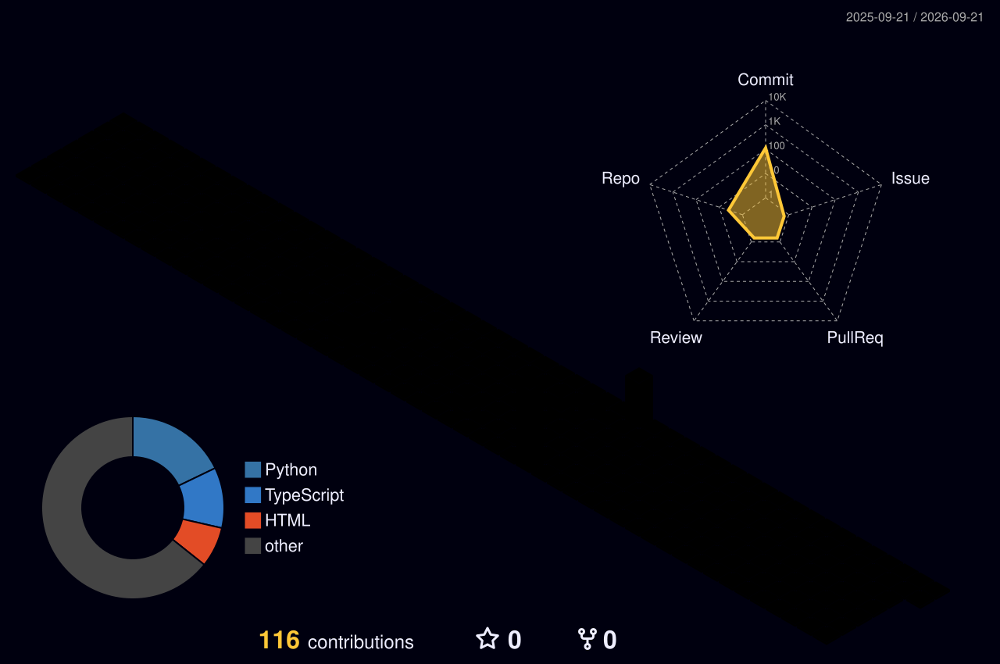

<div align="center">

</div>

<div align="center">

[](https://git.io/typing-svg)

</div>

<br/>

<div align="center">

[](https://www.linkedin.com/in/sur-vaghasiya-031ab9283)
[](mailto:survaghasiya@gmail.com)
[](#)
[](https://github.com/Sur27codes)

</div>

<br/>

<div align="center">

```
$ whoami
────────────────────────────────────────────────────────────────────────
  name     →  Sur Vaghasiya
  role     →  AI Engineer · ML Systems · Full-Stack Developer
  location →  Stony Brook, NY, United States
  school   →  MS Data Science @ Stony Brook University  (May 2027)
  work     →  Data Science & AI Intern @ Adani Enterprise Ltd.
  focus    →  LLMs · RAG · Agentic Workflows · Voice AI · MLOps
  status   →  ✅  Open to AI/ML Engineer · Applied Scientist · SWE
────────────────────────────────────────────────────────────────────────
```

</div>

<div align="center">

</div>

## 🕹️ Game Room

> **GitHub-powered mini-games.** Click → issue opens → bot plays → scores update live.

---

### 🤜 Rock · Paper · Scissors

<div align="center">

[](https://github.com/Sur27codes/Sur27codes/issues/new?title=rps%7Crock&labels=rps&body=I+choose+Rock+🪨!)
&nbsp;&nbsp;
[](https://github.com/Sur27codes/Sur27codes/issues/new?title=rps%7Cpaper&labels=rps&body=I+choose+Paper+📄!)
&nbsp;&nbsp;
[](https://github.com/Sur27codes/Sur27codes/issues/new?title=rps%7Cscissors&labels=rps&body=I+choose+Scissors+✂️!)

</div>

<!-- RPS_SCOREBOARD_START -->
| 👤 You Win | 🤖 Bot Wins | 🤝 Draws | 🎮 Total |
|:---:|:---:|:---:|:---:|
| **0** | **0** | **0** | **0** |

> 🕹️ *No games yet — be the first to challenge the bot!*
<!-- RPS_SCOREBOARD_END -->

---

### 🎲 Lucky Dice Roll

<div align="center">

[](https://github.com/Sur27codes/Sur27codes/issues/new?title=dice%7Croll&labels=dice&body=Rolling+the+dice+🎲)

</div>

<!-- DICE_BOARD_START -->
| ⚀ 1 | ⚁ 2 | ⚂ 3 | ⚃ 4 | ⚄ 5 | ⚅ 6 | 🎲 Total |
|:---:|:---:|:---:|:---:|:---:|:---:|:---:|
| **0** | **0** | **0** | **0** | **0** | **0** | **0** |

> 🎲 *No rolls yet — be the first to test your luck!*
<!-- DICE_BOARD_END -->

<div align="center">

</div>

## 🛸 Active Missions

<table>
<tr>
<td width="50%" valign="top">

### 🔬 [SAARTHI](https://github.com/Sur27codes/SAARTHI) `🟢 DEPLOYED`
**Voice AI Clinical Monitor · HackRare 2026**

Retell AI places daily phone calls to ENS rare-disease patients. Claude Haiku extracts 7 clinical scores with ENS-specific bias correction. **Tri-level ML:** Global RF (n=2,000) → Personal RF (StratifiedKFold) → Welford Z-score override. Next.js + CopilotKit AI copilot.

> 🎯 **Zero patient form-filling · Zero transcript data loss**


</td>
<td width="50%" valign="top">

### 📊 [InsightX](https://github.com/Sur27codes/Insight-X) `🟢 DEPLOYED`
**Real-Time Enterprise Forecasting Platform**

**33% accuracy gain** via Prophet+XGBoost+ARIMA ensemble. Eliminated ALL HTTP timeouts via Redis Pub/Sub + WebSocket streaming. **War Games simulator** for 4 economic scenarios. A2UI/MCP AI copilot renders live React charts inside chat.

> 🎯 **7-service Docker stack · Zero HTTP timeouts**


</td>
</tr>
<tr>
<td width="50%" valign="top">

### 🧠 [EchoMindAI](https://github.com/Sur27codes/EchoMindAI) `🟢 DEPLOYED`
**Multimodal RAG · 16 Live Agentic Tools**

FAISS + HuggingFace RAG pipeline. **16 live tools:** GPT-4o vision, DALL-E 3, stocks, 100+ language translation, PDF/DOCX/CSV ingestion. Groq LPU cut STT latency **7.5×**. 29 KB CSS Injection Engine renders 60fps glassmorphism UI.

> 🎯 **300% engagement lift · 90% fewer failures**


</td>
<td width="50%" valign="top">

### ⛓️ [Decentralized Escrow](https://github.com/Sur27codes/Decentralized_Escrow_Website) `🟢 LIVE`
**Trustless P2P Transactions · Ethereum**

Solidity contract with **dual-party approval** — ETH locked via `msg.value`, released only when both parties approve. React + ethers.js v6.13.4 + MetaMask. Hono.js + Cloudflare Workers serverless backend.

> 🎯 **Zero counterparty risk · Zero intermediaries**


</td>
</tr>
<tr>
<td colspan="2" valign="top">

### 🚦 [LI Traffic Accident Cluster & Severity Analytics](https://github.com/shaneap/AMS-597-Project) `🟡 RESEARCH`
**AMS 597 · Stony Brook · 33,228 records · R + Python**

DBSCAN → **12 crash hotspot clusters** · FAMD + k-Means → **4 risk archetypes** (silhouette=0.4268) · XGBoost **AUC 0.7185** with 27 engineered features · SHAP per-cluster attribution · osmnx road-graph overlays


</td>
</tr>
</table>

<div align="center">

</div>

## 🛠️ Skill Matrix

<div align="center">

</div>

<div align="center">

</div>

## ⚔️ Timeline

<div align="center">

</div>

<div align="center">

</div>

## 📊 Analytics

<div align="center">

[](https://github.com/Sur27codes)

</div>

<div align="center">


</div>

<div align="center">


&nbsp;

&nbsp;


</div>

<div align="center">

</div>

<div align="center">

</div>

<div align="center">

</div>

## 🌐 3D Contribution Calendar

<div align="center">

</div>

<div align="center">

</div>

## 🐍 Contribution Snake

<div align="center">

</div>

<div align="center">

</div>

## 📡 Contact

<div align="center">

| 📧 Email | 💼 LinkedIn | 📍 Location |
|:---:|:---:|:---:|
| [survaghasiya@gmail.com](mailto:survaghasiya@gmail.com) | [sur-vaghasiya-031ab9283](https://www.linkedin.com/in/sur-vaghasiya-031ab9283) | Stony Brook, NY, USA |

</div>

<br/>

<div align="center">

</div>
